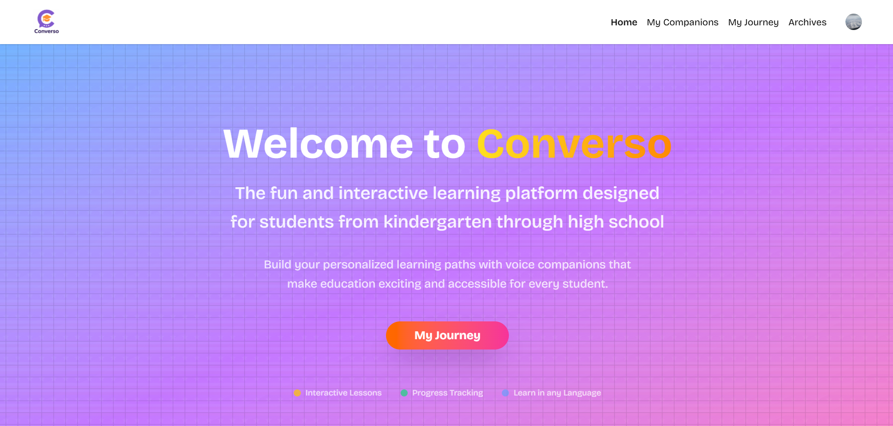

# AI-Powered Learning Companions

A real-time, AI-driven learning platform that lets students (from kindergarten all the way to high-school) build personalised **voice companions** that guide them through interactive lessons.



---

## ✨ Key Features

• **Custom Voice Companions** – Create tutors with their own name, avatar, subject focus, tone and duration.<br/>
• **Real-time Conversation** – Powered by the [Vapi](https://vapi.ai) web SDK for low-latency voice chat.<br/>
• **Auth & Profiles** – Secure user management via [Clerk](https://clerk.dev).<br/>
• **Supabase Back-end** – Store companions, sessions and progress in a Postgres database with row-level security.<br/>
• **Modern UI** – Built with Next.js App Router, Tailwind CSS and Shadcn UI.<br/>
• **Analytics & Monitoring** – Error tracking and performance insights through Sentry (Edge + Server).

---

## 📹 Demo

👉 **Watch the full walkthrough video:** [converso-screencast.mp4](./public/video/converso-screencast.mp4)

---

## 🚀 Getting Started

### 1. Clone & Install

```bash
# clone
git clone https://github.com/ivioje/lms-with-vapi.git
cd lms-with-vapi

npm install 
```

### 2. Environment Variables

Create a `.env.local` file at the project root and populate the following keys:

```bash
# Supabase
NEXT_PUBLIC_SUPABASE_URL=<your-supabase-url>
NEXT_PUBLIC_SUPABASE_ANON_KEY=<your-supabase-anon-key>

# Vapi (voice SDK)
NEXT_PUBLIC_VAPI_WEB_TOKEN=<your-vapi-token>

# Clerk (authentication)
CLERK_SECRET_KEY=<server-secret>
NEXT_PUBLIC_CLERK_PUBLISHABLE_KEY=<publishable-key>

# (Optional) Sentry
SENTRY_DSN=<your-sentry-dsn>
```

### 3. Run the Dev Server

```bash
npm run dev
```

Open <http://localhost:3000> in your browser and start building companions!

---

## 🛠️ Tech Stack

| Layer            | Tech                                           |
|------------------|------------------------------------------------|
| Front-end        | Next.js 15 • React 19 • TypeScript • Tailwind CSS |
| UI Components    | Shadcn UI • Lucide Icons                         |
| Auth             | Clerk (multi-tenant, social logins, plan subscription, billing etc.)       |
| Back-end / DB    | Supabase (Postgres + Row Level Security)        |
| Real-time Voice  | Vapi.ai Web SDK                                 |
| Dev & Ops        | ESLint • Prettier • Sentry Monitoring           |

